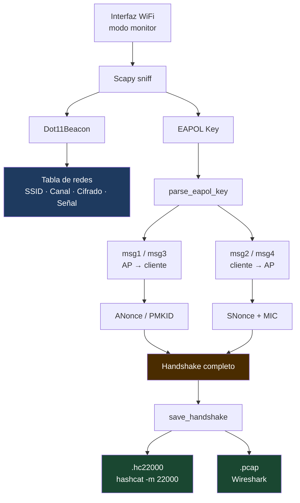

# EAPOL HUNTER


Herramienta para Raspberry Pi escrita en Python que pone una interfaz WiFi en **modo monitor**, escanea redes cercanas y captura **handshakes WPA/WPA2** (EAPOL 4-way y PMKID) guardándolos en formato **hc22000**, listo para procesar con hashcat.

> **Aviso legal:** Esta herramienta es solo para uso en redes propias o sobre las que se tenga **autorización explícita por escrito**. El uso no autorizado puede constituir un delito.

---

## Características

- Pone la interfaz en modo monitor usando `iw` (sin depender de `airmon-ng`)
- Escanea redes 802.11 en 2.4 GHz y 5 GHz con **channel hopping** automático
- Captura handshakes **WPA/WPA2** vía EAPOL 4-way (M1+M2 y M2+M3)
- Extrae **PMKID** del primer mensaje EAPOL (ataque sin cliente)
- Guarda capturas en formato **`.hc22000`** (hashcat `-m 22000`) y **`.pcap`**
- Pantalla en tiempo real con tabla de redes, estado de captura y log de eventos
- Restaura la interfaz a modo managed al salir (`Ctrl+C`)
- Opción `--deauth` para forzar reconexiones y acelerar la captura

---

## Requisitos

### Hardware

La Raspberry Pi 3 tiene WiFi integrado (`wlan0`), pero el chip Broadcom BCM43438 **no soporta modo monitor**. Se necesita un adaptador USB con uno de estos chipsets:

| Chipset | Modo monitor | Inyección |
|---|:---:|:---:|
| Realtek RTL8188EUS | ✔ | ✔ |
| Realtek RTL8812AU | ✔ | ✔ |
| Atheros AR9271 | ✔ | ✔ |
| Ralink RT3572 | ✔ | ✔ |

Verificar soporte de modo monitor:
```bash
iw list | grep -A 10 "Supported interface modes"
# debe aparecer: * monitor
```

### Software

```bash
# Sistema
sudo apt update
sudo apt install -y python3 python3-pip iw libpcap-dev

# Python
pip install scapy
```

---

## Uso

```bash
# Escaneo pasivo
sudo python3 wifi_scanner.py -i wlan0

# Directorio de salida personalizado
sudo python3 wifi_scanner.py -i wlan0 -o /tmp/capturas

# Con deauth (solo redes autorizadas)
sudo python3 wifi_scanner.py -i wlan0 --deauth

# Sin salto de canal (canal fijo)
sudo python3 wifi_scanner.py -i wlan0 --no-hop
```

### Argumentos

| Argumento | Descripción |
|---|---|
| `-i / --interface` | Interfaz WiFi (requerido, ej: `wlan0`) |
| `-o / --output` | Directorio de salida (default: `capturas/`) |
| `--deauth` | Envía frames de desautenticación para forzar reconexiones |
| `--no-hop` | Desactiva el salto de canal |

---

## Pantalla

```
════════════════════════════════════════════════════════════════════════════
  WiFi Scanner + Handshake Extractor (hc22000)         Ctrl+C para salir
════════════════════════════════════════════════════════════════════════════
  BSSID                 SSID                       CH  dBm   Cifrado      Estado
  ──────────────────────────────────────────────────────────────────────
  aa:bb:cc:dd:ee:ff     MiRed                      6   -45   WPA2/WPA3    ✔ GUARDADO → MiRed_aabb.hc22000
  11:22:33:44:55:66     OtraRed                    11  -72   WPA2/WPA3    ⚡ EAPOL(M1+M2)
  ff:ee:dd:cc:bb:aa     Vecino                     1   -88   WPA          —
════════════════════════════════════════════════════════════════════════════
  Redes: 3   Capturando: 1   Guardados: 1   Salida: capturas/
────────────────────────────────────────────────────────────────────────────
  [14:32:01] → EAPOL msg1  OtraRed  11:22:33:44:55:66  (cliente: aa:bb:cc:11:22:33)
  [14:32:02] ⚡ Handshake M1+M2  OtraRed  11:22:33:44:55:66
  [14:32:02] ✔ Guardado  MiRed  [PMKID, EAPOL 4-way]  →  MiRed_aabb.hc22000
════════════════════════════════════════════════════════════════════════════
```

**Estados de captura:**

| Icono | Significado |
|---|---|
| `—` | Sin actividad EAPOL detectada |
| `⚡ EAPOL(M1+M2)` | Handshake capturado, pendiente de guardar |
| `⚡ PMKID` | PMKID extraído del beacon |
| `✔ GUARDADO` | Archivo `.hc22000` escrito en disco |

---

## Archivos generados

Por cada red con handshake capturado se generan dos archivos:

```
capturas/
  NombreRed_bssidhex.hc22000   ← input para hashcat
  NombreRed_bssidhex.pcap      ← captura bruta (Wireshark / hcxpcapngtool)
```

---

## Crackear con hashcat

```bash
# En PC/Mac con GPU (recomendado)
hashcat -m 22000 capturas/*.hc22000 wordlist.txt

# Con reglas
hashcat -m 22000 capturas/*.hc22000 wordlist.txt -r rules/best64.rule

# En la Raspberry Pi (lento)
hashcat -m 22000 capturas/*.hc22000 wordlist.txt
```

Wordlists recomendadas: `rockyou.txt`, SecLists (`/usr/share/wordlists/`).

---

## Cómo funciona



El formato **hc22000** contiene en una sola línea toda la información que hashcat necesita para probar contraseñas sin tener que volver a capturar: BSSID, cliente, SSID, ANonce, frame EAPOL con MIC y tipo de par de mensajes.
